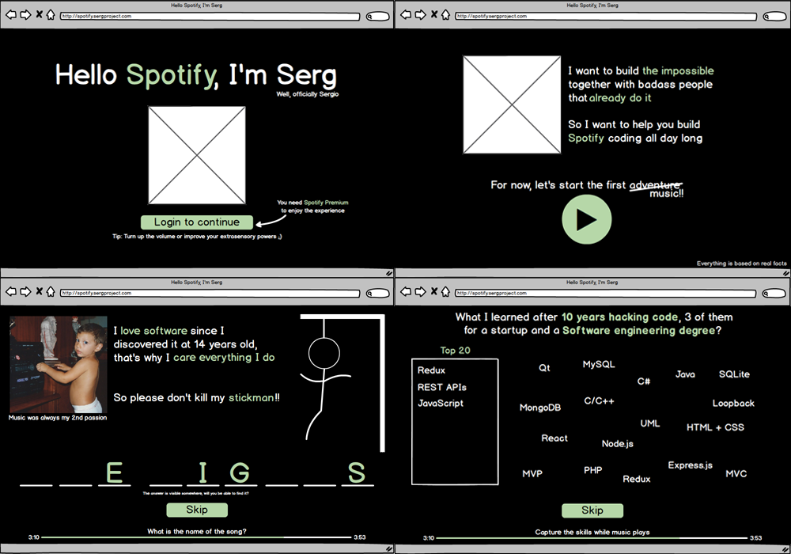

# Hello Spotify, I'm Serg

This is a small project to show who I am, what my knowledge is and the projects to which I have dedicated more time until now, beginnings of 2019. The intention is to describe it in a fun and entertaining way, using the Spotify API to accompany with music a series of games that will provide more information about who I am.

As usual, before starting the development, I designed some mockups of how the application would look like and, despite having introduced some changes, the final result is very similar to the one initially devised. You can download the balsamiq mockups project [here](mockups/spotify_cv.bmpr) or in PDF format [here](mockups/spotify_cv.pdf).

# Purpose
The sole purpose of this project is to make Spotify's recruiters work more entertaining and allow them to see (even superficially) the deep interest I have in working with such amazing people and dedicate my hours to improve even more a product that already is incredible.

# Check it out
You can check out this project without having a Spotify Premium account, but I recommend using it with an account to fully enjoy the experience. C'mon isn't expensive, don't be stingy 😉  
Visit: [spotify.sergproject.com](https://spotify.sergproject.com)
